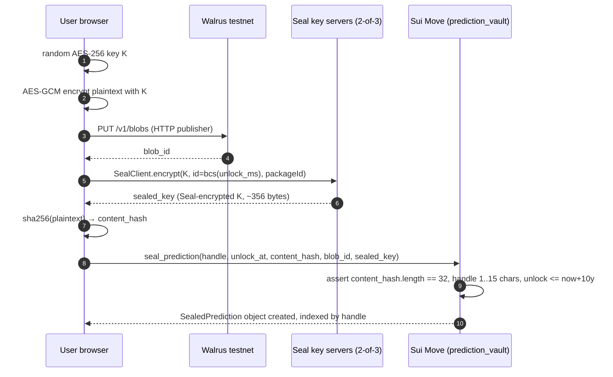
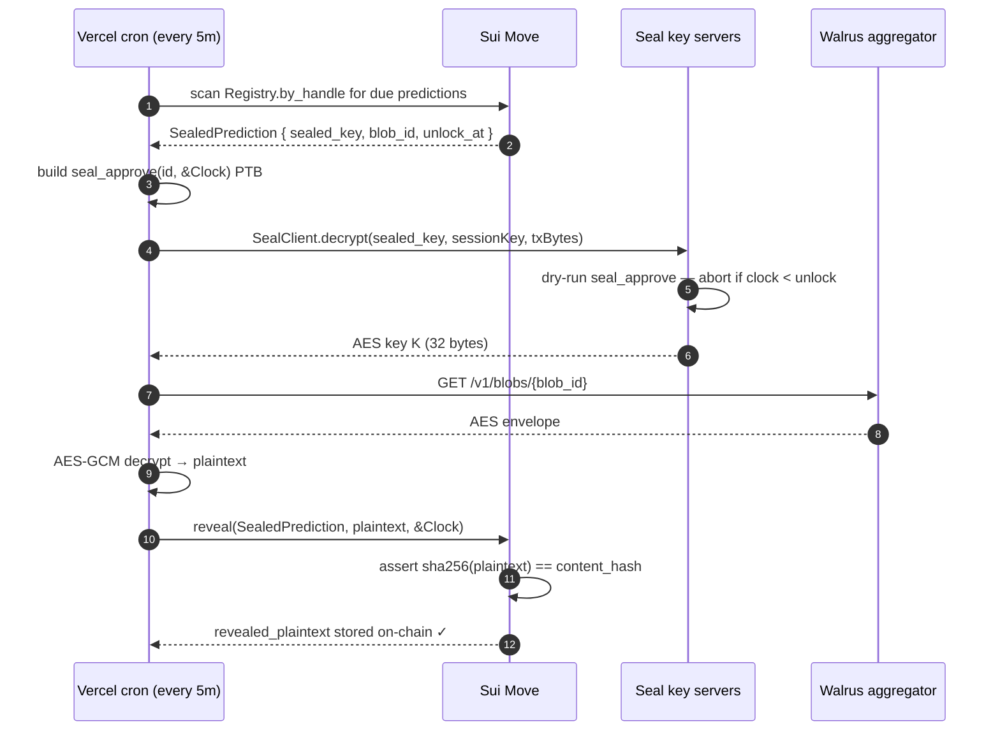
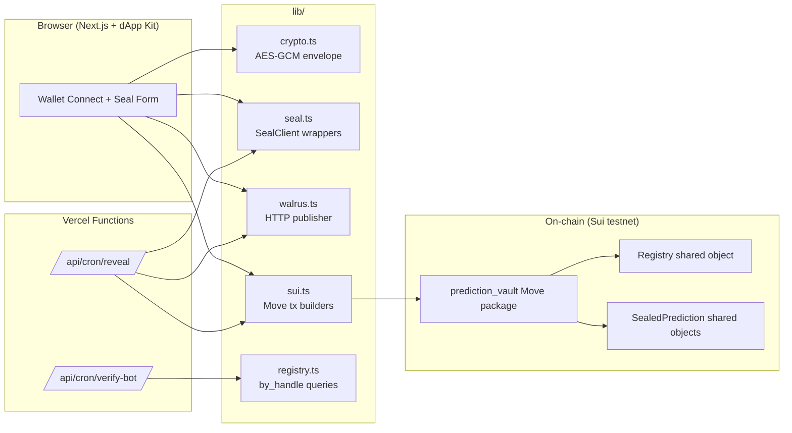

# TOLDPROOF

**Cryptographic receipts for crypto Twitter.** Seal a prediction now → reveal it on-chain when the time-lock expires. No more hindsight farming.

Sui Overflow 2026 · Walrus track · [Audit report](AUDIT_REPORT.md) · [Spec](spec.md) · [Build plan](buildplan.md)

---

## What it does

Type a prediction. Pick an unlock date. Click seal. Your prediction is AES-encrypted in your browser, the ciphertext goes to Walrus (permanent decentralized storage), and the AES key is encrypted under a **Seal time-lock identity** so no one — not even you — can decrypt it before the unlock moment. The commitment hash is anchored on Sui immediately.

At unlock, a Vercel cron decrypts via Seal, fetches the Walrus blob, AES-decrypts the plaintext, and posts a `reveal()` transaction on-chain. The Move contract verifies `sha256(plaintext) == content_hash` before accepting — so the reveal is cryptographically tied to what was committed at seal time. The receipt is permanent, verifiable, and inhumanly hard to fake.

Skeptics can mention `@toldproof verify` on any X tweet — the bot looks up the parent author's handle on-chain and replies with a defamation-safe verdict: *"@x has N sealed predictions. Profile: toldproof.xyz/x"* or *"No sealed prediction found for @x. Absence of proof is not proof of falsehood."*

## Architecture

### Seal flow (browser → on-chain)



### Reveal flow (cron → on-chain)



### Components



## Tech stack

| Layer | Choice | Why |
|---|---|---|
| Smart contracts | Sui Move 2024 — `prediction_vault` | OTW + versioned `Registry` shared object; `Table<String, vector<ID>>` indexes by X handle for direct on-chain profile reads |
| Storage | Walrus testnet | Permanent, decentralized, public ciphertext anchor |
| Encryption | Seal (2-of-3 Mysten + Ruby Nodes committee) | IBE time-lock; AES envelope so rotating operators only re-encrypts 32 bytes |
| Frontend | Next.js 16 (App Router, TS strict) + Tailwind v4 + `@mysten/dapp-kit-react` | Wallet-standard for Phantom Sui / Slush / Sui Wallet |
| Hosting | Vercel + cron | Fluid Compute Node.js; `*/5 * * * *` for reveal + verify-bot |
| Hashing | `std::hash::sha2_256` (Move) + `crypto.subtle.digest('SHA-256')` (Web Crypto) | Universal verifiability — anyone can `echo -n "..." | sha256sum` to check |

## Security

- **Audit**: [`AUDIT_REPORT.md`](AUDIT_REPORT.md) — `/dewaxguard` multi-agent audit. 0 Critical, 0 High, 1 Medium, 4 Low, 4 Info. **Every actionable finding addressed** in commit [`ebf7899`](https://github.com/BadGenius22/toldproof/commit/ebf7899) (raised test count 11 → 19).
- **`seal_approve` is `entry`, not `public entry`** — other packages cannot compose it and bypass Seal's dry-run isolation.
- **Hash gate on reveal** — `assert!(sha256(plaintext) == content_hash)`; Move-level enforcement of "what's revealed is what was committed".
- **Defamation-safety mechanically enforced** — the verify-bot's reply text is unit-tested for accusatory language (`lying`/`false`/`fake`/`fraud`/...); regression-protected against future PRs.
- **2-of-3 Seal committee** — any one operator can be down without breaking new predictions.

## Testing

| Suite | Count | Catches |
|---|---|---|
| `sui move test` (Move) | **19** | seal_approve before/after/exact-unlock, BCS trailing-byte attack, reveal happy/sad paths, double-reveal, wrong-plaintext, all input validators (content_hash length, blob_id, sealed_key, handle, unlock cap) |
| `vitest` (TS lib/) | **26** | AES round-trip + tamper + wrong-key + key-length, SHA-256 known vectors, `epochsForUnlock` boundary cases, defamation-safety verdict scan |
| **Total** | **45** | All run on every push via `.github/workflows/move-ci.yml` |

Plus the live testnet negative test ([`scripts/test-seal-negative.ts`](scripts/test-seal-negative.ts)) — confirms Seal key servers actually refuse decryption before unlock against a real prediction. Demonstrated on Day 2 and recorded in the commit log.

## Build + run

```bash
# Move
cd move/prediction_vault
sui move build --warnings-are-errors --lint
sui move test                                # 19/19

# TypeScript
pnpm install
pnpm typecheck && pnpm test && pnpm build    # 26/26 vitest + Next prod build

# CLI flows (needs .env.local with testnet IDs)
pnpm seal "BTC > 95k by 2026-06-30" 3600 elonmusk
pnpm reveal 0x...                            # after unlock
pnpm test:seal-negative 0x...                # while still locked → verifies Seal refuses

# Dev server
pnpm dev
```

## Project status

- Sui Move package on testnet: `0x46cc247cc1af9a6101cabf9c74734410428ba789baad69d86c61197bd9428335` (re-deploy after audit fixes scheduled for Day-10 final)
- Live e2e on testnet verified Day 2 (`0x0b53360fa…` revealed plaintext recovered)
- Pre-Day-3 negative test confirmed Seal refuses pre-unlock decryption with the real committee
- Frontend SSR-renders the verify page against testnet RPC
- Reveal cron + verify-bot routes wired (X bearer token activates the bot when ready)

See [`buildplan.md`](buildplan.md) for the day-by-day status; [`spec.md`](spec.md) for the strategic framing.

## License

Apache-2.0.
